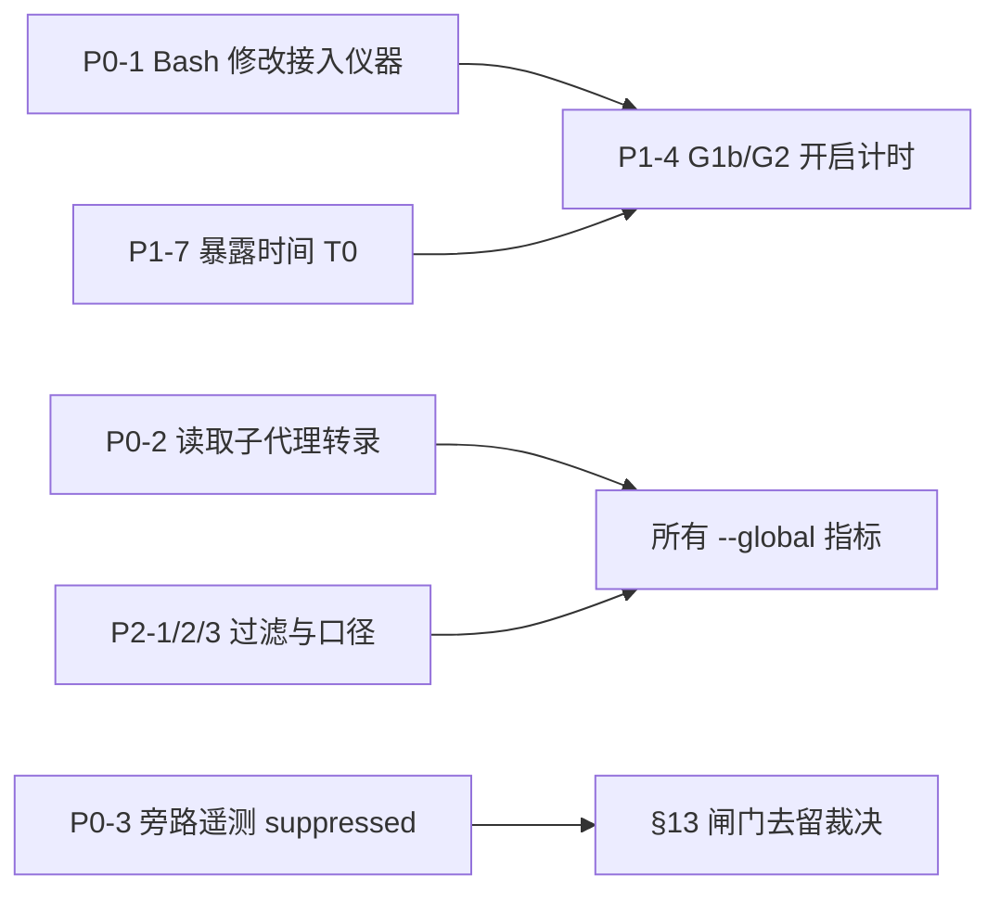

# Claude 编程历史会话分析 — 2026-09-26

> 语料:本机 `~/.claude/projects/*/*.jsonl` 225 个主会话 + `*/<sid>/subagents/*.jsonl` 681 个子代理转录,
> 时间 2026-09-05 → 2026-09-26(22 天),外加 `~/.claude/logs/claudemd.jsonl` 7,714 行遥测与本仓库 git 历史。
> 本项目(`-home-ai-dev-claudemd`)37 个会话;claudemd 是全局规范 + hook 插件,在其余项目的会话里同样运行,
> 所以"hook / 规范 / 指标"类结论用全机语料,"本项目的工作过程"类结论只用这 37 个会话。
> 脚本与数据快照:`tasks/transcript-analysis-2026-09-26/`(`an.py` → `rows.json`,`agg.py` → `agg.out`,
> `extra.py --replay` → `extra.out`)。转录 30 天后被清理(09-05 的数据约在 10-05 消失),快照是唯一的复算来源。

---

## 0 结论摘要

按"修了之后能改变什么"排序。每条都附当轮测量值;标 **[推断]** 的是相关性或未单独验证的归因。

| # | 类别 | 发现 | 关键数字 |
|---|---|---|---|
| 1 | 指标缺陷 | **Bash 改文件通道对所有编辑类仪器不可见。** Opus 5.5 把大部分修改写成 `python3 - <<'PY' … open(p,'w')`,而 `rework-breaker`、`evidence-gate`、`ledger-staleness`、`session-end-check` 与 `sampling-audit` 的返工指标都只认 Edit/Write 工具 | W4 修改事件 82.8% 走 Bash;W4 返工率工具口径 0/17,计入 Bash 后 8/21 |
| 2 | 指标缺陷 | `sampling-audit` 不读 `subagents/` 目录,其"子代理流量与主会话同文件"的前提(`scripts/sampling-audit.js` 第 171 行)在 CC 2.1.278 起已不成立 | 子代理占全部工具调用 43.1%(31,344 / 72,650) |
| 3 | 指标缺陷 | §8 旁路遥测只要命令里出现令牌字面量就记一次 `bypass-escape-hatch`,检测器被整段跳过,记录不了是否真的压下了拒绝 | 31 条中去掉令牌重放:29 条本来就放行,2 条会被拒 |
| 4 | 阻碍 | **前台 `sleep N` 死等**(等子代理输出文件、等 CI) | 主会话 36.5 h 阻塞,其中本项目 12.1 h;全期(含子代理)79 次命令超时**全部**是这类 sleep |
| 5 | 成本 | 长会话占掉近一半输入 token | 平均每次请求上下文 315k token;>400k 的请求占请求数 28.6%、输入 token 46.3%(本项目 53.6%) |
| 6 | 过程 | 发版速度快于现场暴露速度,评估窗口互相截断 | 22 天 28 个版本;本机 09-14 → 09-23 一直跑 0.88.0,期间 0.89–0.92 已发布 |
| 7 | 过程 | G1b/G2(路线图权重 35%)默认关闭且本机未开启,30 天 FP 时钟从未启动;即使开启,在 Opus 5.5 下也只看得到约 1/5 的修改 | 全期 `evidence-gate` 1 行、`rework-breaker` 0 行遥测 |
| 8 | 缺陷 | 规范 §2.2 要求的 `ship` 技能在本机不存在 | `Unknown skill: ship / gstack:ship` 9 次(09-06 → 09-21) |
| 9 | 阻碍 | worktree 隔离的代理用主仓库绝对路径操作被 harness 拒绝 | 75 次,分布在 09-08 / 09-11 / 09-20 / 09-25 四天,未收敛 |
| 10 | 缺陷 | `sandbox-disposal` 提醒不收敛:同一会话反复提醒,残留数不降 | 88 个被提醒会话中 37 个 ≥3 次,单会话最多 25 次 |
| 11 | 残留 | `~/.claude/projects/` 下 8 个 headless 探针项目目录未清理,`clean-residue` 不覆盖这个位置 | 09-19 → 09-26,最新一个是 09-26 06:48 的 `-var-tmp` |
| 12 | 数据质量 | 手工探针写进真实遥测;`session_id=null` 的合成行能通过审计过滤器 | 9 条 deny + 12 条 allow-provenance 残留;`skillInvocations` 把 9 次失败调用计为调用 |

**不是问题**(数据否定或已解决,见第 5 节):hook 延迟、hook 注入体积、测试弱化、"继续"催促、`/tmp` tmpfs 写满、上下文长度与工具错误率的关系。

---

## 1 数据与方法

### 1.1 语料

| 项目 | 会话 | 交互 | headless | 人类提示 | 工具调用 | 输出 token | 时间 |
|---|---:|---:|---:|---:|---:|---:|---|
| claude-mem-lite | 59 | 59 | 0 | 325 | 13,001 | 11.3M | 09-05 → 09-26 |
| **claudemd** | **37** | 37 | 0 | 302 | 7,689 | 7.2M | 09-05 → 09-26 |
| code-graph-mcp | 34 | 34 | 0 | 200 | 8,013 | 6.9M | 09-05 → 09-26 |
| loop-eng | 22 | 14 | 8 | 116 | 2,959 | 2.7M | 09-19 → 09-26 |
| loop-testing | 14 | 13 | 1 | 218 | 3,660 | 3.9M | 09-19 → 09-23 |
| gsd-lite / daagu / moa-skill | 24 | 24 | 0 | 205 | 5,927 | 5.5M | 09-13 → 09-21 |
| 8 个 `-tmp-*` / `-var-tmp` 探针目录 | 35 | 0 | 35 | 35 | 57 | <0.1M | 09-19 → 09-26 |
| **合计(主会话)** | 225 | 181 | 44 | 1,401 | 41,306 | 37.5M | |
| 子代理 | 681 | | | | 31,344 | 3.0M | |

- 模型(按请求数):Opus 5 33,253,Opus 5.5 4,864(09-22 起),Fable 5.1 624,Haiku 4.5 129。
- CC 版本:2.1.261 → 2.1.283,W1 以 2.1.263 为主,W4 以 2.1.282/283 为主。
- 周分桶:W1 09-05..11 / W2 09-12..18 / W3 09-19..22 / W4 09-23..26(W4 只有 4 天,样本小)。

### 1.2 口径

- **错误**:`tool_result.is_error=true`,按内容前缀分类(hook 拒绝 / Bash 非零 / 超时 / 编辑匹配失败 / 工具不可用 …)。
- **token**:assistant 记录按 `message.id` 去重后累加 `usage`;"上下文"= input + cache_creation + cache_read。
- **sleep 阻塞**:前台 Bash(排除 `run_in_background`)里 `sleep N` 的 N ≥ 30,阻塞时长取 `min(N, timeout)`,
  timeout 缺省 120 s。
- **返工**:会话内同一文件被修改 ≥8 次(沿用 09-21 基线的阈值)。"工具口径"只数 Edit/Write/MultiEdit;
  "合并口径"另加 `toolUseResult.bashEditDiff.files[].filePath`(CC ≥2.1.278 才有此字段)。
- **交叉验证**:`node scripts/sampling-audit.js --global --days=30 --json` 的 `editedSessions=160`、
  `reworkSessions=81` 与 `an.py` 的工具口径逐项相等;遥测 deny 与转录 §8 拒绝按 `tool_use_id` 对账,
  629 个唯一 id 全部匹配。

### 1.3 已知限制

- 语料在分析期间仍在增长(本会话自己也在写),复跑时 W4 的计数会有个位数变化。
- `turn_duration` 只在较新的 CC 版本出现,不能当全期分母,所以本文不报"sleep 占回合时长的百分比"。
- 转录只记录有输出的 hook(`hook_success` 附件),claudemd 的 PreToolUse 延迟在转录里观察不到。
- 单一使用者、单一机器;所有"原因"都是观察性的。

---

## 2 总体画像

| 指标 | 全机主会话 | 本项目 | 子代理 | 09-21 基线 |
|---|---:|---:|---:|---:|
| 工具调用错误率 | 1,042/41,306(2.52%) | 222/7,689(2.89%) | 1,246/31,344(3.98%) | — |
| §8 拒绝 / 千次 Bash | 8.4 | — | 14.8 | — |
| 返工 ≥8(工具口径) | 81/160(50.6%) | 12/30(40.0%) | 13/247(5.3%) | 74/125(59.2%) |
| 测试编辑中弱化+删用例 | 62/1,911(3.2%) | | | 3.4% |
| 技能调用 / 工具调用 | 63/41,306(其中 9 次失败) | 12/7,689 | 16/31,344 | 61/33,063 |
| 会话最大上下文 p50 / p90 | 419k / 651k token | | | — |
| 压缩 | 10 个会话共 12 次 | 5 次 | | — |
| 开局首请求上下文(中位数) | 09-11 起稳定在 56–62k token | | | — |

错误构成(主会话,每千次工具调用):Bash 非零 8.8、§8 拒绝 5.9、code-graph 拒绝原生 grep 4.6、编辑匹配失败 1.6、
超时 1.4、§11 记忆门拒绝 1.1、其余合计 <2。Bash 非零属于正常开发反馈;下面只展开能被改变的部分。

---

## 3 缺陷与指标问题

### B1 Bash 改文件通道对编辑类仪器不可见【P0】

**现象**

| 周 | Edit/Write 次数 | Bash 改动文件数(bashEditDiff) | Bash 占比 | 返工 ≥8 工具口径 | 合并口径 |
|---|---:|---:|---:|---:|---:|
| W1 | 3,036 | 未记录 | — | 35/64 | — |
| W2 | 1,143 | 未记录 | — | 14/16 | — |
| W3 | 3,300 | 111 | 3.3% | 32/63 | 34/63 |
| W4 | 201 | 967 | **82.8%** | **0/17** | **8/21** |

`bashEditDiff` 从 CC 2.1.278 才开始出现,所以 W1/W2 的 Bash 改动没有结构化记录。用命令文本启发式
(`open(...,'w')` / `.write_text(` / `sed -i` / `writeFileSync`,排除写 `/tmp`)估计:

| 模型 × CC 版本 | Edit/Write | Bash 写文件 | Bash 占比 |
|---|---:|---:|---:|
| Opus 5 × <2.1.278 | 4,128 | 1,954 | 32% |
| Opus 5 × 2.1.278–280 | 3,175 | 896 | 22% |
| Opus 5.5 × 2.1.278–280 | 72 | 126 | 64% |
| Opus 5.5 × ≥2.1.282 | 201 | 796 | 80% |

同一 CC 版本下 Opus 5.5 是 64%(n=198)、Opus 5 是 22%(n=4,071),模型是主要的相关因素。CC ≥2.1.282 在 bypass 权限模式下的系统提示
明确允许"用 sed / heredoc / 短脚本代替 Edit 做小改动"(本会话的系统提示里就有这段),它可能进一步推高比例
**[推断]**:≥2.1.282 上没有 Opus 5 的会话,两个因素无法分开。

**影响**

- `hooks/rework-breaker.sh` 注册在 `PostToolUse Edit|Write`,Bash 修改不触发。
- `hooks/evidence-gate.sh` 第 154 行、`hooks/ledger-staleness.sh` 第 184/202 行、`hooks/session-end-check.sh` 第 88 行
  判断"是否有代码修改"时只认 `.name == "Edit" or .name == "Write"`。
- `scripts/sampling-audit.js` 的 `scanBehavior`(约 910 行起)只数 Edit/Write,W4 的"返工 0/17"是仪器盲区造成的假象。
- 09-21 基线的 59.2% 也是工具口径,而 W1–W3 按文本启发式有 23–35% 的修改走 Bash,没被计入。计入后返工会话数只增不减;
  比率的方向还取决于"只用 Bash 改文件"的会话进入分母的数量(W3:32/63 → 34/63)。
- 仓库里没有任何代码读取 `bashEditDiff`(`grep -rn bashEditDiff hooks scripts` 无结果)。

### B2 `sampling-audit` 漏掉子代理转录【P0】

`scripts/sampling-audit.js` 第 171 行写着 "subagent traffic shares the file under isSidechain:true"。从 CC 2.1.278 起,
子代理写入 `<proj>/<sid>/subagents/agent-*.jsonl`。Round 17 的 HK-H1 已经在 §11 记忆门里修过**同一个根因**,
度量脚本这条兄弟路径没有跟着修。该脚本的 `validity` 声明里写"subagent work is under-represented by an unmeasured
amount",这个量现在测得出来:子代理占全部工具调用的 43.1%;它的 §8 拒绝率(14.8/千次 Bash)是主会话(8.4)的 1.8 倍,
错误率 3.98% 对 2.52%。不纳入子代理,任何"遵从率"或"摩擦"指标都偏向主会话。

### B3 §8 旁路遥测记录的是"令牌出现",不是"压下了拒绝"【P0】

`hooks/pre-bash-safety-check.sh` 第 825 行对**原始命令**做 `grep -qF '[allow-rm-rf-var]'`,命中后记一行
`bypass-escape-hatch`,并跳过整个 rm 检测块。令牌出现在 heredoc 数据、python 源码字符串、commit message 里
同样生效(注释里写明这是有意设计:"so the marker can live anywhere")。

31 条 §8 旁路行逐条回查:发出命令前用户消息里都没有出现令牌;命令内容是编辑 hook 源码、语料 `corpus.tsv`、
CHANGELOG,或评审子代理在沙箱里测试 hook。去掉令牌后用当前 hook 在沙箱 HOME、`DISABLE_RULE_HITS_LOG=1` 下重放:
**29 条放行,2 条拒绝**。也就是说 `/claudemd-audit` 的 byBypass 有 29/31 行其实没有压下任何拒绝。这是
§13.1/§13.2 裁决闸门去留时要读的数字。

(重放用的是 0.97.0 的 hook,不是当时的版本,不同版本的判定可能有差异。)

### B4 技能调用指标把失败的调用计为调用【P2】

`scanBehavior` 见到 `tu.name === 'Skill'` 就计数,不看结果。63 次里有 9 次是 `Unknown skill: ship / gstack:ship`
的失败调用(14%)。在"技能路由是否有效"的讨论里,这个量直接被引用。

### B5 合成遥测行的过滤缺口【P2】

`excludeTestSessions`(`scripts/lib/rule-hits-parse.js`)过滤 `t`/`test` 和 ≤7 字符的会话 id(`s8probe`、`loc`
已被正确过滤),但**不过滤 `session_id=null`**(注释解释:历史上许多真实行没有 session_id)。结果:9 条 deny、
12 条 `rm-rf-allow-provenance` 既无 session_id 也无 `tool_use_id`,来自 09-07/08 的手工探针,仍计入审计。
更可靠的判据是:PreToolUse 类 hook 的真实行一定带 `toolu_` 开头的 `tool_use_id`。

另外 45 条 `memory-read-check fail-open reason=mem-index-missing` 来自本来就没有 MEMORY.md 的项目:这是"规则不适用",
不是"闸门坏了"。两者混在 byFailOpen 里,会把"不适用"算成"失明"。

### B6 规范引用本机不存在的 `ship` 技能【P1】

core §2.2 写 "`ship` skill required",本机没有 `ship`,也没有 `gstack:ship`。本项目有 runbook 记忆兜底
(manual-ship override),其他项目没有:09-06 → 09-21 共 9 次失败调用,都是试图调用发版技能。

### B7 `sandbox-disposal` 提醒不收敛【P1】

遥测 292 条 warn 分布在 88 个会话;37 个会话被提醒 ≥3 次,单会话最多 25 次,大多数会话从首次到末次的
`count` 基本不变(提醒次数最多的 12 个会话里,首末相等 7 个、减 1 的 4 个、增加的 1 个)。每次 Stop 都重复同一条提醒,说明它要么被忽略,要么数的是不该由当前会话清理的东西。
两者要靠抽样标注区分,本文没有做。v0.97.0 新加的 opt-in Stop block 在标注之前不宜改成默认开启。

### B8 探针项目目录残留,且清理工具不覆盖【P2】

`~/.claude/projects/` 下 8 个目录来自 headless `claude -p` 探针:loop-eng(09-19)、loop-testing 沙箱(09-19/20)、
`-tmp-tmp-hQy54clzSp-r`(09-23)、code-graph-mcp scratchpad 三个(09-25)、`-var-tmp`(09-26 06:48,内容是一次
`echo "$PATH"` 探针)。它们既是全局状态残留,也混进了所有 `--global` 度量的语料(35 个 headless 会话)。
`scripts/clean-residue.js` 里没有任何 `projects` 路径。删除需要你授权,本文只报告。

### B9 部署滞后与版本混跑(指标层面)【P1】

遥测 `hook_version` 按日分布:09-14 → 09-23 本机一直是 0.88.0,而 0.89.0(09-15)、0.90.0–0.92.0(09-22)已经发布;
同一天常见两个版本并存(如 09-06 有 0.74.2 / 0.76.1 / 0.76.2)。含义:

- 按发布日期划的评估窗口会把旧版本的数据算给新版本(D#57 的记忆已经记过一次)。
- 路线图 R1/R2 的新 hook 在头几天没有任何现场暴露。
- 按版本比较时必须按**会话**归属版本,不能按日期。

---

## 4 阻碍与效率

### 4.1 前台 sleep 死等【P1】

| 周 | 主会话 sleep≥30s 次数 | 阻塞小时 | 每千次工具调用 | 等 CI | 等文件 | 裸 sleep |
|---|---:|---:|---:|---:|---:|---:|
| W1 | 247 | 21.6 | 14.5 | 117 | 73 | 57 |
| W2 | 98 | 7.4 | 18.0 | 37 | 60 | 1 |
| W3 | 170 | 6.6 | 11.7 | 107 | 60 | 3 |
| W4 | 29 | 0.9 | 6.6 | 11 | 16 | 2 |

- 本项目主会话合计 12.1 h。全期 79 次命令超时全部是 `sleep N` 超过该命令的超时上限,多数是默认 120 s(如 `sleep 235; cat …/tasks/*.output`、
  `sleep 600; gh run list …`),每次超时都要重发命令。
- "等文件"主要是等后台任务或子代理的输出文件。harness 在后台 Bash 和子代理完成时会自动唤醒会话,所以这类等待不必要
  (§11 与记忆 `feedback_subagent_delivery_at_turn_end` 已经写明,W4 下降可能与此有关 **[推断]**)。
- "等 CI"是发版流程固有的等待,但方式可以换:`gh run watch <id> --exit-status` 放进 `run_in_background`,
  完成时 harness 通知,既不会超时也不会猜时长。
- 子代理 W4 反而上升(9.4/千次)。

### 4.2 长会话与 token 消耗【P1】

| 请求时的上下文 | 请求占比 | 输入 token | 占比 | 本项目占比 |
|---|---:|---:|---:|---:|
| <200k | 26.3% | 1.41B | 11.5% | 9.6% |
| 200–400k | 45.1% | 5.18B | 42.2% | 36.7% |
| 400–600k | 23.9% | 4.47B | 36.4% | 35.6% |
| ≥600k | 4.7% | 1.22B | 9.9% | 18.0% |

输入 token 的 99.2% 是 cache read,单价低但量大:平均每次请求带 315k token 上下文。本项目的典型形态是一个会话里
连续做多件事("剩余还有哪些有价值工作需要做的"出现 5 次,之后直接在同一会话继续),上下文从 60k 累积到 400–900k。
开局固定开销约 60k,而且从 09-11 起稳定在 56–62k,**成本来自会话内累积,不是来自规范体积**。

关于质量:按请求时上下文分桶的"非 Bash 退出码类工具错误率",<200k 为 3.4/千次(95% CI 2.8–4.0),
≥600k 为 5.2/千次(n=1,727,9 次,95% CI 2.4–9.9)。区间重叠,**数据不支持"长上下文导致更多工具错误"**,
也不能排除它。拆会话的理由目前只有成本这一条是有数据支撑的。

### 4.3 子代理

681 个子代理,cache 写入 156.6M token,超过主会话的 96.5M(子代理的系统提示与主会话不同,缓存无法复用 **[推断]**);本项目 112 个。
工具调用错误率和 §8 拒绝率都比主会话高(见 B2)。§8 拒绝多的一个可能原因是子代理的上下文里没有主会话积累的
`rm` 守卫经验 **[推断]**。

### 4.4 worktree 隔离报错

75 次 "This agent/session is isolated in the worktree …",集中在 4 天(code-graph-mcp 37、loop-testing 21、
claudemd 17)。前两者是 `isolation: "worktree"` 的子代理:提示词里写的是主仓库绝对路径,代理照着
`cd /home/ai/dev/<proj>` 就被拒绝;claudemd 的 17 次是一个本身运行在 worktree 里的主会话去操作主仓库路径。

### 4.5 本项目的工作过程

- **发版节奏**:22 天 28 个 tag,218 个提交(fix 101、docs 40、feat 20、converge 15);28 个版本里 18 个带有
  review / repair / pre-tag 提交,合计 37 个(17%);revert 5 个。与记忆中"修复轮引入下一轮缺陷"的画像一致。
- **发版快于暴露**:§EXT §13.3 要求行为层 hook 收 30 天 FP 数据,而本机平均每 0.8 天出一个版本,
  且安装更新要等 `/claudemd-refresh`。任何一个版本都攒不到一个完整的评估窗口,后一个改同一闸门的版本
  就会截断前一个版本的窗口(D#58 的 PREREG 已经为此写了截止规则)。
- **元工作循环**:37 个会话的首条提示里,"剩余还有哪些有价值工作" 5 次、"全面审核" 4 次、"按报告修复" 4 次、
  "端到端 QA" 3 次。项目的主要工作对象是它自己。
- **粘贴交接**:5 个会话以粘贴上一会话的 "Not done" 报告开头(09-22 ×3、09-25、09-26)。未完成项没有落到
  会话之外的持久位置,只能靠人工复制。
- **痛点由使用者发现**:子代理评审截断(09-22)、`/tmp` 写满(09-22)、rm 拒绝频繁(09-25)、残留目录(09-26)、
  上下文过大(09-21),都是使用者自己观察后提出的。

---

## 5 被数据否定或已解决的假设

| 假设 | 数据 | 结论 |
|---|---|---|
| hook 拖慢了编程 | 全部 hook 合计 2,255 s;claudemd 的 Stop 链(8 个脚本)p50 合计约 0.26 s/次,最慢的 `session-start-check.sh` p95 1.7 s,只在会话开始时跑 | 不是瓶颈 |
| hook 注入挤占上下文 | 全部 `additionalContext` 约 4.2 MiB / 225 会话,每会话约 19 KiB;最大单项是 superpowers 的 SessionStart 全文注入(1.2 MiB,每会话约 5.8 KiB) | 相对 315k 的平均上下文可忽略 |
| AI 会弱化测试 | 1,911 次测试编辑中弱化 43、删用例 19,合计 3.2% | 与 09-21 基线(3.4%)一致,不需要新规则 |
| 回合无声停顿需要用户催 | 30 次"继续/next":13 次是 converge 按轮停下的设计行为,3 次是 API 断连,约 3 次是回合在计划中途停下(如以"修复:"结尾、"等 CI 绿就打 tag"),其余是明确提问或等待子代理 | 中途停顿约 3/1,357 条人类提示,不需要新机制 |
| `/tmp` tmpfs 经常写满 | `Command output was lost … ENOSPC` 19 次,全部在 09-07/08 | 之后未再出现,已解决 |
| 长上下文导致工具错误增加 | 见 4.2,置信区间重叠 | 未检测到,不是"无影响" |
| §8 rm 闸门摩擦持续很高 | 主会话每千次 Bash 的 §8 拒绝:09-19..22 为 5.8–27.9,09-25/26 为 2.1/2.6;子代理 15–33 → 4.3/4.8 | 0.94.1 暴露后明显下降。**这只是一次描述性窥视**,按 `tasks/d57-rm-gate-eval/PREREG.md`,结论只在窗口结束时看一次 |
| code-graph 拒绝原生 grep 造成大量摩擦 | 全期 422 次(主 188 + 子 234),W4 为 0 | 已由 code-graph-mcp 侧改掉,不属于本项目 |

---

## 6 建议

原则:先修仪器,再评估闸门;每条都给出验收判据和复测命令,避免"看起来改善"其实是仪器失明(B1 已经发生过一次)。

### P0 — 修仪器(不改任何闸门判定)

**P0-1 把 Bash 改文件通道接入所有编辑类仪器**(对应 B1)

- `sampling-audit.js#scanBehavior`:在 user 行上读 `toolUseResult.bashEditDiff.files[].filePath`,与 Edit/Write
  合并计入 `perFile`;`behaviorMetrics` 增加 `editChannel: {tool, bash}`;CC <2.1.278 的会话标注 `bashEditUnobservable`。
- `evidence-gate.sh` / `ledger-staleness.sh` / `session-end-check.sh`:它们本来就读转录,把"user 行带非空
  `bashEditDiff.files`"也当作一次代码修改。
- `rework-breaker.sh`:先做一次 0a 式本机探针,确认 `PostToolUse` 的 Bash `tool_response` 里是否带 bashEditDiff;
  带就直接加 `Bash` matcher,不带就在 Stop 或下一次 PostToolUse 里读转录尾部。**不要跳过探针直接设计**。
- 验收:`sampling-audit --global` 在同一语料上复现合并口径 W4 = 8/21;每个 hook 加一条 python-heredoc 修改的
  夹具用例,并做"删掉 bashEditDiff 分支 → 用例变红"的变异检查。

**P0-2 `sampling-audit` 读取 `subagents/*.jsonl`**(对应 B2)

- 按 `main` / `sub` 分层输出(沿用 `behaviorMetrics.byClass` 的分层方式);`validity` 里"unmeasured amount"改为实测比例。
- 验收:`toolUses` 合计 = 72,650 ± 当日增量;子代理 `skillInvocations` = 16。

**P0-3 旁路遥测记录"是否真的压下了拒绝"**(对应 B3)

- 令牌存在时仍以只读方式跑一遍检测器,判定不变(照旧放行),遥测里加 `suppressed: true|false`;
  `/claudemd-audit` 的 byBypass 只把 `suppressed=true` 计为旁路。这只改遥测,不改判定,符合记忆
  `feedback_gate_fix_deny_only_by_construction` 的约束。
- 验收:对 31 条历史命令重放,`suppressed=true` 为 2 条;`tests/fixtures/bash-safety/corpus.tsv` 全绿。

### P1 — 去掉已测到的阻碍

**P1-1 前台长 sleep**(对应 4.1)

- 先看 W4 的下降能否保持:每周复算 `extra.py` 第 1 节;若主会话连续两周 ≤7/千次,就不加机制。
- 若回升:加一个 opt-in 的 PreToolUse Bash advisory,前台 `sleep ≥ 60` 时提示两种替代:等后台任务或子代理 → 直接结束回合等通知;
  等 CI → `gh run watch <id> --exit-status` 配 `run_in_background`。按 §13.3 默认关闭并预注册。
- 验收指标:主会话前台 sleep 小时数与 sleep 类超时次数(基线:主会话 W1–W3 共 35.6 h;全期 sleep 超时 79 次)。

**P1-2 长会话**(对应 4.2)

- 使用习惯层面:一个任务结束、下一个请求与之无关时,用 `/clear` 或开新会话,把未完成项写进交接文件(见 P2-4)。
- 机制层面(可选,opt-in):UserPromptSubmit 读转录里最后一次 `usage`,上下文 >400k 时提示一次"考虑开新会话"。
- 验收:输入 token 中 >400k 请求的占比(基线全机 46.3%、本项目 53.6%)。收益按 token 计;质量收益目前没有数据,不要写进理由。

**P1-3 `ship` 技能引用改为"可用时"**(对应 B6)

- core §2.2 改为 "`ship` skill if installed (doctor verifies);else manual ship"。这是规范自改,按 §EXT §13 META 走,属 L3。
  core 目前 24,979/25,000 B,需要同步净删。
- `/claudemd-doctor` 增加一项:规范点名的技能在本机是否可解析。
- 验收:`Unknown skill` 失败调用为 0。

**P1-4 G1b/G2 的评估前置条件**(对应摘要 #7)

- P0-1 完成之前**不要**开启 `EVIDENCE_GATE` / `REWORK_BREAKER` 开始 30 天计时,否则计的是一个只看得到约 20% 修改的仪器。
- P0-1 完成后,参照 `REPLY_LANGUAGE_CHECK` 的做法:在 settings env 开启,在 `tasks/<slug>/PREREG.md` 写好 T0(第一条新
  `hook_version` 遥测行)、基线、功效表和停止规则。

**P1-5 worktree 隔离代理的路径约定**(对应 4.4)

- 在派发模板或 §EXT §11-O 写一条:`isolation: "worktree"` 的代理提示词只用相对路径或 `$PWD`,不写主仓库绝对路径。
- 验收:`isolated in the worktree` 报错计数(基线 75 次 / 4 天)。

**P1-6 `sandbox-disposal` 提醒收敛**(对应 B7)

- 同一会话只在 `count` 比上次提醒时增加才再提醒。
- 先抽 20 条 warn 标注"属于当前会话且应清理"与"不属于/不该清理",再决定 opt-in Stop block 能否默认开启。
- 验收:≥3 次提醒的会话占比(基线 37/88)。

**P1-7 发版节奏与暴露**(对应 B9、4.5)

- ship runbook 增加一步:发版后记录 `installed_plugins.json` 版本与遥测第一条新 `hook_version` 的时间,也就是 T0。
- 改同一个闸门或同一个行为层 hook 的版本合批发布,两次之间至少留出一个能攒够预注册样本量的窗口。纯 fix 不受限。

### P2 — 数据质量与卫生

- **P2-1** 审计过滤器:PreToolUse 类 hook 的行没有 `toolu_` 开头的 `tool_use_id` 就判为合成行(B5)。
- **P2-2** `mem-index-missing` 改记 `not-applicable`,从 byFailOpen 中分出去(B5)。
- **P2-3** 失败的技能调用单独计 `skillInvocationErrors`(B4)。(落地时更正:`skillInvocations` 是 09-21 预注册字段,仍计全部调用,失败数在旁边单列,不相减。)
- **P2-4** 未完成项的持久交接:会话结束报告里的 Not done 同步写入 `mem_defer` 或 `tasks/<slug>-paused.md`,
  下一会话由 SessionStart 注入。目标是不再需要粘贴。现有 `session-end-check` 只在有修改时写 paused 文件,
  4 个项目里还有 10 个最长 13 天的旧文件没人处理。
- **P2-5** `clean-residue` 覆盖 `~/.claude/projects/-tmp-*` 与 `-var-tmp` 这类探针目录,按"非活跃会话 + 超龄"判定,默认 dry-run(B8)。
  现有 8 个目录等你授权后清理。
- **P2-6** 技能清单瘦身:每会话 31K 字符的 skill listing 对应 63 次调用 / 225 会话。按项目关闭该项目从未调用的插件
  (`sampling-audit` 的 `skillsByName` 就是现成的清单)。这是 settings 变更,需要授权。
- **P2-7** 转录在 30 天后清理:09-05 起的数据约在 10-05 消失。凡是要做前后对比的基线,都要在清理前把脚本和
  数据快照固化到 `tasks/`(本文已经这样做)。

### 不建议做

- 优化 hook 延迟、继续压缩 core 规范体积:数据显示两者都不是主要成本(第 5 节、4.2)。
- 新增测试弱化规则、按"继续"次数新增停顿规则:数据不支持(第 5 节)。
- 在 P0-1 之前依据 `rework` 指标下任何结论:W4 的数字是仪器盲区。

---

## 7 优先级与依赖



建议的施工顺序:P0-1 → P0-2 → P0-3(同一个 plugin minor,都只动仪器),然后 P1-4 开始计时;
P1-1/P1-2 先只观察两周;P1-3 是规范自改,单独一个 spec minor。

---

## 附 A 复现

```bash
cd tasks/transcript-analysis-2026-09-26
python3 an.py rows.json          # 逐会话事实 → rows.json(约 6 s)
python3 agg.py rows.json         # 第 1–2 节、第 5 节的聚合表
python3 extra.py --replay        # sleep / 修改通道 / 遥测对账 / 旁路重放 / 上下文分桶 / 重复错误
node ../../scripts/sampling-audit.js --global --days=30 --json | jq .behaviorMetrics   # 交叉验证
```

`--replay` 会在 `$TMPDIR` 下建临时 HOME,用 `DISABLE_RULE_HITS_LOG=1` 调用当前的 `hooks/pre-bash-safety-check.sh`,
结束时删除。

## 附 B 与 2026-09-21 基线的对照

| 量 | 09-21 基线(178 会话) | 本次(225 会话) | 备注 |
|---|---|---|---|
| 返工 ≥8 | 74/125(59.2%) | 81/160(50.6%) | 两者都是工具口径;W4 盲区见 B1 |
| 测试弱化+删用例 | 3.4% | 62/1,911(3.2%) | 一致 |
| 技能调用率 | 61/33,063(0.18%) | 63/41,306(0.15%),其中 9 次失败 | B4 |
| §8 拒绝 | 552 次 / 8 个项目 | 629 个唯一拒绝(主 242 + 子 387) | 口径不同:本次含子代理 |
| 子代理 | 未计入 | 681 个转录,占工具调用 43.1% | B2 |

---

## 附 C 处理状态(2026-09-26 同日)

| 项 | 状态 | 提交 / 证据 |
|---|---|---|
| P0-1 Bash 修改接入仪器 | evidence-gate / ledger-staleness / session-end-check / sampling-audit 已完成;**rework-breaker 未做** | `d464592`、`ad45330`。rework-breaker 需要先探针:headless `claude -p`(2.1.283)的 PostToolUse payload 和转录里都没有 `bashEditDiff`,会话中途新加的 project-local hook 又不会热加载,只能在新开的交互会话里测。已登记 D#88 |
| P0-2 读取子代理转录 | 完成 | `ad45330`。复算:子代理 681 个转录、31,344 次 tool_use、Skill 16 次,与本文一致;主会话工具口径 81/160 保持不变,合并口径 91/165 |
| P0-3 旁路遥测 `suppressed` | 完成 | `69d3947`。**验收数字更正**:保留令牌重放 34 条历史旁路,`suppressed=true` 只有 **1** 条;本文 B3 的"2 条拒绝"里另一条在带令牌时也会被**其他**模式拒绝,和 rm 令牌无关。同时修复了一个新发现的缺陷:命令里没有 `$VAR` 时,旁路行拼成 `"vars":}`,被存为 `extra:null`(第一次重放时的 33 条里 19 条;第二次重放时日志已增长到 34 条) |
| P2-1 审计过滤 id 缺失的探针行 | 完成 | `5a3d6c4`。`testSessionsFiltered` 46 → 67(+21 = 9 deny + 12 allow-provenance) |
| P2-2 `mem-index-missing` 与失明分开 | 完成 | `5a3d6c4`。`byFailOpen` 新增 `notApplicable` / `blind`;doctor 与 audit 共用同一集合 |
| P2-3 技能失败调用单列 | 完成(评审后更正口径) | `ad45330` 曾把失败调用从 `skillInvocations` 里减掉(63 → 54),这改动了 09-21 预注册的 G0 字段;`e27bd5b` 恢复为全部 63 次,失败的 9 次(`ship` 6、`gstack:ship` 3)在旁边单列为 `skillInvocationErrors` |
| P1-7 发版记录暴露 T0 | 完成(runbook 记忆) | `feedback_claudemd_ship_from_main_atomic.md` 第 11 步 + 合批规则 |
| P2-7 快照固化 | 完成 | 重放脚本另存为 `tasks/transcript-analysis-2026-09-26/replay_suppressed.py` |
| P1-1 / P1-2 / P1-4 | 按本文建议只观察,不改代码 | P1-4:P0-1 的 rework-breaker 完成前不开启计时 |
| P1-3 / P1-5 / P1-6 / P2-4 / P2-5 / P2-6 | 待授权 | 见下 |

**B7 的标注结果(替代原计划的 20 条抽样)**:开机(09-25 08:04)以来 77 次提醒共列出 149 个路径,**现在一个都不存在**;127 个(85%)是本仓库 `tests/run-all.sh` 自己建的 `claudemd-test-*` / `claudemd-suitelog-*`,都有 trap 清理。提醒不收敛的主因是 Stop 触发时后台测试还在跑,临时目录被当成了残留,不是会话忽略了提醒。"count 增加才再提醒"治不了这个根因。建议改为延迟一轮确认:本轮只记录候选,下一轮仍存在才提醒。代价是会话最后一轮留下的残留不再提醒。opt-in Stop block 不应默认开启。

全量验证:`npm test` rc=0(OVERALL: all suites passed),`npm run smoke` 2/2,`npm run lint` rc=0。CHANGELOG 条目留到发版时写(0.98.0)。

### 授权后完成的 L3 项与独立评审(同日)

| 项 | 提交 |
|---|---|
| P2-5 清理探针目录 | `98043d9`(代码)、`a44e476`(评审修复:只清 headless 会话 `entrypoint: sdk-cli`,memory 目录读不了时保留,测试用沙箱 HOME)。已删除本机 9 个探针目录(8 个由工具删除,当天的 `-var-tmp` 手动删除) |
| P1-6 延迟一轮确认 | `d46e466`、`c8b779f`(补登记状态文件);关闭开关 `SANDBOX_DISPOSAL_IMMEDIATE=1` |
| P2-4 交接注入 | `1360443`;关闭开关 `DISABLE_PAUSED_BANNER=1`;评审 L6 后,名字含非常规字符的检查点只计数、不回显 |
| P1-3 / P1-5 规范 v6.35.0 | `3251326`(doctor `routing:ship-skill`)、`ef6ed69`(core §2.2 "`ship` skill if listed (else manual)"、§EXT §11-O Worktree spawn)。本机的根因:gstack 的 ship 在 `~/.claude/skills/gstack/ship/`,是路由下的子技能,没有注册 |

独立评审(全新上下文子代理):0 Critical / 1 High / 6 Medium / 7 Low。§8 判定在 2,779 次新旧对比中没有变化。已修:H1(`e27bd5b`)、M1/M3/L5(`a44e476`)、M2(`e345b4b`)、M4 的 12 个存活变异(均已补测试并确认能杀掉)、M5(`e27bd5b`)、L1/L2/L3/L4/L6。未修:M6(CHANGELOG 与 0.98.0 版本号留给发版步骤)、L7(`session-end-check` 遇到字符串 content 的 assistant 行时整段 jq 失败,本分支之前就存在)。
