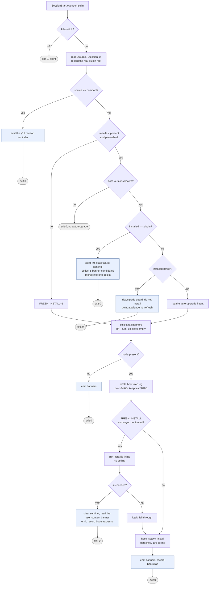

# Flow: SessionStart bootstrap

**In one line.** On every session start this hook decides whether to install the spec into
`~/.claude/` right now, and folds up to five notices left by the previous session into
**exactly one** JSON object.

**Entry point.** `hooks/hooks.json` wires `SessionStart` (matcher `*`, 5s timeout) to
`hooks/session-start-check.sh`. The event JSON arrives on stdin.

This is the expansion of the "Bootstrap / version sync" entry in
[`ARCHITECTURE.md`'s Main flows](../ARCHITECTURE.md#main-flows), which states the same path in
five steps. Read that one first if all you need is the shape.

## How to read the citations

Each step names its file and a **verbatim anchor** — a fragment that occurs exactly once in
that file. Line numbers are deliberately absent: every edit above a line moves it, and a doc
full of stale numbers teaches readers to stop trusting it. `tests/scripts/flow-doc-anchors.test.js`
re-resolves every anchor on each run and fails if one stops matching exactly once, so an anchor
that disappears is a red build rather than a silent lie. To find a step in the source, grep its
anchor.

## Two constraints that explain almost every branch

1. **stdout may carry exactly one JSON object.** Claude Code parses hook output with a strict
   single-value `JSON.parse`, so printing two objects is invalid JSON and **both** banners are
   dropped silently. Everything is therefore collected first and merged once.
2. **Spec text only works by being read.** Claude Code assembles `~/.claude/CLAUDE.md` into
   context at session start, so a detached install loses that race by construction. That, and
   nothing else, is why a fresh install runs synchronously while an upgrade runs detached.

## The path

## Step by step

**1. Kill-switch** — `hooks/session-start-check.sh` → `hook_kill_switch SESSION_START || exit 0`

`DISABLE_SESSION_START_HOOK=1`, or the plugin-wide switch, exits immediately and does nothing.

**2. Read the event fields** — `hooks/session-start-check.sh` → `jq -r '.source // ""'`

Only `.source` and `.session_id` are taken; a missing `jq` or a malformed event is fail-open.

**3. Record the real plugin root** — `hooks/session-start-check.sh` → `hook_record_plugin_root "$PLUGIN_ROOT"`

Writes `hook-root.json`. The directory Claude Code **actually loaded** can only be measured from
inside a running hook, and doctor's two hook-drift rows use it as their local basis. It happens
*before* the compact early exit, because a compacted session fired its hooks from the real root
just the same.

**4. Compact branch** — `hooks/session-start-check.sh` → `if [[ "$SOURCE" == "compact" ]]; then`

On `source == "compact"` the hook emits only the §11 re-read reminder and exits: **a compaction
event must never trigger an install.**

**5. Decide whether this is a fresh install** — `hooks/session-start-check.sh` → `jq -e . "$MANIFEST_NEW" >/dev/null 2>&1 || FRESH_INSTALL=1`

Neither manifest location present means fresh. So does a manifest that exists but does not
parse: a half-written file is not an installed state, and re-entering the bootstrap is the
repair. Gated on `jq`, because without it "corrupt" and "legacy, no `.version`" are
indistinguishable.

**6. Unknown version, do nothing** — `hooks/session-start-check.sh` → `if [[ -z "$PLUGIN_VER" || -z "$INSTALLED_VER" ]]; then`

If either side's version cannot be read — a pre-0.1.9 manifest, no `jq`, an unreadable
`package.json` — exit 0 rather than bootstrap-looping on broken state.

**7. Versions agree** — `hooks/session-start-check.sh` → `if [[ "$INSTALLED_VER" == "$PLUGIN_VER" ]]; then`

The local install is current. This is the canonical "everything in order locally, now look
outward" branch.

**8. Clear the stale sentinel** — `hooks/session-start-check.sh` → `# rather than by adding a second guard. Same path, same swallow, one home.`

Since the versions agree, any `bootstrap-failed` sentinel is stale — the state healed
out-of-band, e.g. a manual `/claudemd-refresh`. Cleared silently, through the shared
`hook_install_sentinel_clear` rather than a private `rm`.

**9. Merge five banner candidates** — `hooks/session-start-check.sh` → `merge_banners "$stale_json" "$up_json" "$sum_json" "$drift_json" "$uc_json"`

Stale-cache check, upstream check, session summary, spec drift, and user-content, folded into
**one** object. The upstream check runs only when the stale check produced nothing, or the user
gets two banners about the same thing.

**10. Downgrade guard** — `hooks/session-start-check.sh` → `NEWER=$(printf '%s\n%s\n' "$PLUGIN_VER" "$INSTALLED_VER" | sort -V | tail -1)`

An installed version **higher** than this hook's own means Claude Code fired the hook from a
stale versioned cache dir. Installing from there would downgrade the spec, so the hook skips it
and tells the user to run `/claudemd-refresh` — the one fix only they can apply.

**11. Log the upgrade intent** — `hooks/session-start-check.sh` → `auto-upgrade: manifest $INSTALLED_VER`

Versions differ and it is not a downgrade: write one line to `claudemd-bootstrap.log`, then fall
through to the install block.

**12. Collect banners before installing** — `hooks/session-start-check.sh` → `_bf_json=$(emit_bootstrap_failed_banner)`

Two of these helpers **consume** state the bootstrap is about to rewrite, so the candidate set is
computed first. `uc` stays empty here; only the synchronous branch can fill it.

**13. No node** — `hooks/session-start-check.sh` → `command -v node >/dev/null 2>&1 || { emit_tail_banners; exit 0; }`

Without node there is nothing to install, but the banners are still owed: they describe state a
**prior** session left behind and are consume-once, so skipping the print here loses them
permanently.

**14. Rotate the log** — `hooks/session-start-check.sh` → `LOG_BYTES=$(wc -c < "$LOG" 2>/dev/null | tr -d ' ')`

Over 64 KiB, keep the last 32 KiB. Best effort: any failure leaves the file as-is.

**15. Fresh installs run inline** — `hooks/session-start-check.sh` → `platform_timeout 4 node "$PLUGIN_ROOT/scripts/install.js" 2>&1`

The most counter-intuitive step in the flow. Everywhere else the hook avoids blocking session
start; here it must block, or the spec's first appearance in context slips to the third session
counting from `/plugin install`. Opt out with `CLAUDEMD_FORCE_ASYNC_BOOTSTRAP=1`. Hook
*enforcement* was never affected by the old behaviour — `hooks.json` and the rule data are read
straight from the plugin — only the half of the spec that works by being read.

**16. The synchronous success path** — `hooks/session-start-check.sh` → `_uc_json=$(emit_user_content_banner)`

Clear the sentinel, then read the user-content banner **now**: the session that loses the user's
hand-written `CLAUDE.md` is the session that gets told about it, rather than the next one.

**17. A timeout is not a dead end** — `hooks/session-start-check.sh` → `install.js writes its manifest LAST`

`install.js` writes the manifest last and atomically, so a run killed at the ceiling leaves no
manifest and the next SessionStart re-enters this same path — and this run still falls through to
the detached spawn below, which makes the branch never worse than what it replaced.

**18. Detached install** — `hooks/session-start-check.sh` → `hook_spawn_install "$PLUGIN_ROOT" "$LOG"`

Detached, 10s ceiling, writes or clears the failure sentinel accordingly. Any failure is
fail-open.

**19. Tail** — `hooks/session-start-check.sh` → `hook_record session-start bootstrap null '' "$SESSION_ID"`

Emit the one JSON object, record a `bootstrap` row, exit 0. **Whichever path it took, the hook
always exits 0.**

## Shapes that look like detours and are not

- **`emit_session_summary_banner` has two call sites**, one in the version-match branch and one
  in the bootstrap tail. The second was added deliberately by the 2026-07-26 audit: before it,
  the session following every upgrade and every fresh install showed nothing at all, and the
  state file was not consumed either, so the prior session's summary surfaced one session late
  rather than at all. The two paths are mutually exclusive.
- **The match branch merges five candidates, the bootstrap tail merges three.** The tail skips
  the spec-drift and upstream checks on purpose: an upgrade is in flight, so drift is expected
  and an outward check is noise on top of a local change already happening.
